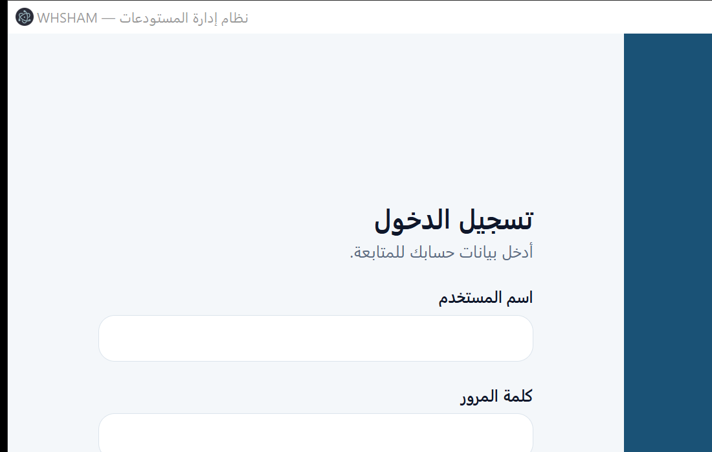

# مستودعات مديرية صحة دمشق المركزية

**Damascus Health Directorate Central Warehouses** — نظام إدارة مستودعات صحية مركزية كتطبيق سطح مكتب
**محلي بالكامل**: يعمل دون إنترنت، ودون خادم، ودون أي خدمة سحابية، وبقاعدة بيانات على الجهاز نفسه.

[](https://github.com/ibrahims78/Damascus-Health-Directorate-Central-Warehouses/actions/workflows/ci.yml)
[](https://github.com/ibrahims78/Damascus-Health-Directorate-Central-Warehouses/actions/workflows/codeql.yml)
[](https://github.com/ibrahims78/Damascus-Health-Directorate-Central-Warehouses/releases/latest)
[](LICENSE)
[](https://www.electronjs.org/)
[](https://www.typescriptlang.org/)
[](https://nodejs.org/)

---

## نظرة عامة

تطبيق سطح مكتب لويندوز لإدارة مخزون المستودعات الصحية: كتالوج المواد، الأرصدة والدفعات، حركات الإدخال
والإخراج والنقل والإتلاف والتسوية، العهد الشخصية، المورّدون، التقارير، وسجل تدقيق غير قابل للتعديل —
مع واجهة عربية كاملة من اليمين إلى اليسار.

صُمّم التطبيق لمؤسسة تعمل في بيئة شبكة محدودة أو منقطعة: كل شيء يعمل على جهاز واحد، والبيانات لا تخرج منه.



## المزايا الأساسية

| المجال | التفصيل |
|---|---|
| **المخزون** | إدخال بدفعات (رقم دفعة + تاريخ صلاحية) · إخراج بنظام **FIFO** (الأقرب انتهاءً أولًا) · نقل بين مستودعين مع الحفاظ على الدفعات · إتلاف · تسوية جرد بفرق صريح |
| **المواد والمستودعات** | كتالوج مواد موحّد (رمز، باركود، وحدة، تصنيف، حد أدنى) · هيكل مستودعات بأنواع ومواقع وسعات · مورّدون ومصادر توريد |
| **العهد الشخصية** | تسجيل عهدة بخصم فوري من المستودع · إرجاع جزئي أو كامل · **تشفير الرقم الوطني** بكشف مُسجَّل في التدقيق |
| **الباركود** | مسح بالكاميرا (BarcodeDetector) + إدخال يدوي يدعم أجهزة قراءة الباركود |
| **التقارير** | 6 تقارير جاهزة (أرصدة · حركات · تحت الحد الأدنى · قرب الانتهاء · عهد مفتوحة · سجل التدقيق) مع تصدير CSV بتوافق Excel العربي |
| **الإدارة** | مستخدمون وأدوار ومصفوفة صلاحيات · نسخ احتياطي واستعادة بفحص سلامة · إعدادات الجهة و**إغلاق مالي** يمنع الحركات في فترات مُقفلة |
| **التواصل** | تعميمات وتنبيهات داخلية |

## الأمان — المبدأ الحاكم

> لا يوجد أي منطق أمني في الواجهة. كل قرار صلاحية يُتخذ في العملية الرئيسية (Main) ويُفحص قبل التنفيذ، وكل عملية حساسة تُقيَّد في سجل تدقيق لا يقبل التعديل.

| الطبقة | ما تم تنفيذه |
|---|---|
| عزل المحتوى | `contextIsolation` + `sandbox` + تعطيل `nodeIntegration` + سياسة `Content-Security-Policy` + منع التنقّل وفتح النوافذ |
| جسر IPC | 42 قناة معرّفة بأسماء صريحة (لا تمرير قنوات عام) + تحقق `zod` لكل حِمل + خريطة صلاحية لكل قناة + عدم إعادة أي تفاصيل تقنية إلى الواجهة |
| المصادقة | تجزئة `scrypt` بملح مستقل لكل مستخدم · مقارنة زمنية ثابتة · قفل الحساب بعد 5 محاولات فاشلة (15 دقيقة) · مهلة جلسة خمول · إلزام تغيير كلمة المرور الأولية |
| الصلاحيات | 8 أدوار × 25 صلاحية من مصدر واحد · **إنكار ضمني** لأي صلاحية غير ممنوحة · حماية آخر مدير نظام من التعطيل أو التخفيض · تسجيل كل محاولة مرفوضة |
| سجل التدقيق | إضافة فقط (منع الحذف على مستوى قاعدة البيانات) + **سلسلة بصمات SHA-256** + زر تحقق يكشف أي تعديل على القيود |
| سلامة البيانات | قيود `CHECK`/`TRIGGER` تمنع الأرصدة السالبة · كل حركة داخل معاملة واحدة (لا أثر جزئي) |
| البيانات الشخصية | الرقم الوطني مشفَّر بـAES-256-GCM بمفتاح محلي مُقيَّد الصلاحيات · لا تُخزَّن أي قيمة خام |
| التشغيل | نسخة واحدة فقط من التطبيق · سجل تشخيص محلي `diagnostics.log` · نسخة أمان تلقائية قبل أي استعادة |

## البنية

```
src/
├── shared/        مصفوفة الأدوار والصلاحيات والثوابت (مصدر الحقيقة الوحيد)
├── main/          العملية الرئيسية (Node)
│   ├── db/        schema.ts (المخطط وقواعد العمل) · sqlite.ts (كاشف node:sqlite) · database.ts (التهيئة)
│   ├── services/  crypto · audit · auth · users · catalog · inventory · custody · reports · backup · notices · settings
│   └── ipc/       contract.ts (العقد + التحقق) · register.ts (التسجيل + فحص الصلاحيات)
├── preload/       الجسر الآمن (contextBridge) — واجهة محدّدة بأسماء صريحة
└── renderer/      واجهة React عربية RTL (screens/ · panels/ · components/)
tests/             core.test.ts (اختبارات وحدات) · scenario.e2e.ts (سيناريو كامل على قاعدة على القرص)
scripts/           setup-electron.mjs (تركيب وقت تشغيل Electron محليًا دون إنترنت)
```

**المكدّس التقني:** Electron 44.3.0 · React 19 · TypeScript 5 (إعداد `strict`) · Vite / electron-vite ·
Tailwind CSS · `zod` · **`node:sqlite`** المدمج في Node (بدون أي وحدة أصلية).

> لماذا `node:sqlite` بدل وحدات SQLite الأصلية؟ لأنه مدمج في وقت التشغيل: لا بناء تجميعي، ولا تنزيل رؤوس،
> ولا كسر عند تحديث إصدار Electron — وهذا يجعل التطبيق قابلًا للبناء والتشغيل في بيئة معزولة تمامًا.

## البدء السريع

```bash
# 1) تثبيت الاعتماديات (يتخطى تنزيل وقت تشغيل Electron)
npm install --ignore-scripts

# 2) تركيب وقت تشغيل Electron محليًا (أو شغّل npm install مع اتصال بالإنترنت)
npm run setup:electron

# 3) التشغيل في وضع التطوير
npm run dev
```

### أوامر التحقق

```bash
npm run typecheck     # فحص الأنواع (0 أخطاء)
npm run test          # اختبارات الوحدة
npm run test:e2e      # سيناريو كامل على قاعدة بيانات حقيقية على القرص
npm run build         # البناء الإنتاجي
npm run verify        # كل ما سبق بالتتابع
```

### نسخة محمولة (Portable) تعمل دون تثبيت

**الطريقة الأسهل:** نزّل الحزمة الجاهزة من [صفحة الإصدارات](https://github.com/ibrahims78/Damascus-Health-Directorate-Central-Warehouses/releases/latest) — فُك الضغط ثم شغّل الملف التنفيذي مباشرة.

**أو ابنِها محليًا** (وقت تشغيل Electron المحلي + مخرجات البناء داخل `resources/app`):

```bash
npm run build:portable      # ينتج: release/portable/WHSHAM-Central-Warehouses.exe
```

الموقع التعريفي للمشروع (GitHub Pages): <https://ibrahims78.github.io/Damascus-Health-Directorate-Central-Warehouses/>

عند أول تشغيل تُكتب كلمة مرور المدير الأولية في
`%APPDATA%\damascus-health-directorate-central-warehouses\first-run-admin-password.txt`
ويُجبَر المستخدم على تغييرها فور الدخول. يُنصح بحذف الملف بعد التغيير.

## نتائج التحقق

| الفحص | النتيجة |
|---|---|
| `npm run typecheck` | **0 أخطاء** (`strict` + `noUncheckedIndexedAccess`) |
| `npm run test` | **8/8 ناجحة** |
| `npm run test:e2e` | **ناجح بالكامل** — إدخال 65 وحدة · FIFO صحيح · نقل · عهدة بتشفير الرقم الوطني وإرجاع · تسوية · تقارير · نسخة احتياطية · سلسلة تدقيق سليمة (20 قيدًا) |
| `npm run build` | ناجح — main 185.8kB (مكتفية بذاتها) · preload 3kB · renderer 695.8kB + CSS 25.7kB |
| تشغيل التطبيق | فتح النافذة بنجاح عبر النسخة المحمولة (Electron 44.3.0 / Node 24.20.0) وسجل تشخيص نظيف |
| التهيئة الأولى | `schema_version=2` · 8 أدوار · 48 صلاحية · 16 جدولًا · المستودع المركزي · حساب `admin` بحالة active |

## نموذج البيانات

16 جدولًا في قاعدة محلية بصيغة SQLite (WAL): `users` · `roles` · `role_permissions` · `user_warehouses` ·
`warehouses` · `materials` · `batches` · `stock_items` · `movements` · `suppliers` · `personal_custody` ·
`notices` · `audit_log` · `settings` · `schema_migrations` · `sqlite_sequence`.

قواعد العمل مفروضة في القاعدة نفسها لا في الواجهة: لا رصيد سالب، ولا حذف لقيود التدقيق، وكل حركة تُقيَّد
في الجدول المخصص لها.

## تخصيص المشروع

| ما تريد تغييره | مكانه |
|---|---|
| بيانات الجهة (الاسم، العنوان، الهاتف) والأغلاق المالي | شاشة **الإعدادات** داخل التطبيق (أو جدول `settings`) |
| الأدوار والصلاحيات | `src/shared/permissions.ts` — ملف واحد يحكم كل شيء |
| قنوات الاتصال بين الواجهة والخدمات | `src/main/ipc/contract.ts` (العقد) و`register.ts` (خريطة الصلاحيات) |
| قواعد المخزون (FIFO، منع الرصيد السالب) | `src/main/services/inventory.ts` و`src/main/db/schema.ts` |
| الهوية البصرية والألوان | `tailwind.config.ts` (رموز تصميم مركزية) |
| أيقونة الحزمة والمثبّت | `package.json` ← قسم `build` (يتطلب إضافة `build/icon.ico`) |

## حدود معروفة

- **ويندوز فقط** حاليًا (الحزم مُعدّة لـNSIS؛ يمكن إضافة أهداف Linux/macOS عند الحاجة).
- **جهاز واحد**: لا مزامنة بين أجهزة (يمكن إضافتها لاحقًا كطبقة اختيارية).
- **الذكاء الاصطناعي مستبعَد** في هذه النسخة (قرار مقصود للعمل دون إنترنت).
- ملف قاعدة البيانات غير مشفّر بالكامل؛ التشفير مطبَّق على الحقول الحساسة. التشفير الكامل للملف
  (SQLCipher) يتطلب وحدة أصلية مُخصّصة.
- مثبّت NSIS موقّع رقميًا غير مُنتَج بعد؛ النسخة المحمولة تغني عنه للاستخدام المباشر.

## الرخصة

هذا المشروع مُرخَّص تحت [رخصة MIT](LICENSE).
